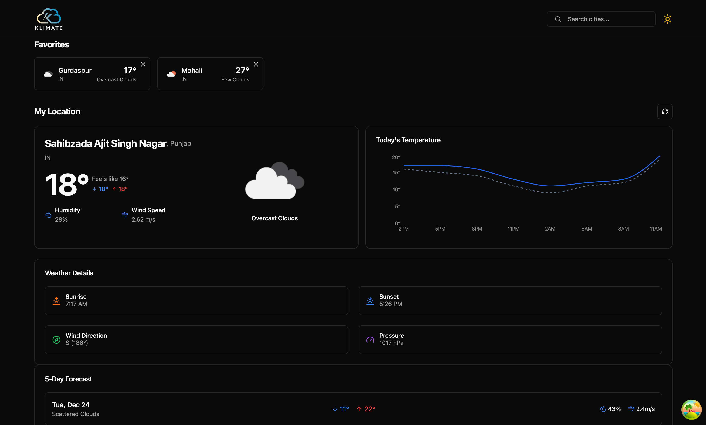

<h3 align="center">🌦️ Klimate-Forecast</h3>

Klimate-Forecast is a modern weather app built with React.js, leveraging Tanstack Query, Shadcn UI, Recharts, Tailwind CSS, and TypeScript. It integrates the OpenWeather API to deliver real-time weather updates with dynamic charts and a responsive, elegant UI.

---

<h4>📌 Key Features</h4>

🌍 **Real-Time Weather Data**

-   **OpenWeather API**: Get up-to-the-minute weather data for any location worldwide.
-   **Dynamic Charts**: Visualize weather trends with interactive charts using Recharts.

⚡ **Efficient State Management**

-   **Tanstack Query**: Simplify data fetching and caching for optimal app performance.

🎨 **Modern User Interface**

-   **Shadcn UI & Tailwind CSS**: Deliver an elegant, responsive, and user-friendly design.
-   **Fully Type-Safe**: Ensures complete type safety with TypeScript for robust code.

---

<h4>🛠️ Built With</h4>

-   **Frontend**: [React.js](https://reactjs.org/), [Tailwind CSS](https://tailwindcss.com/), [Shadcn UI](https://ui.shadcn.com)
-   **Data Handling**: [Tanstack Query](https://tanstack.com/query), [OpenWeather API](https://openweathermap.org/api)
-   **Charts**: [Recharts](https://recharts.org/en-US/)
-   **Language**: [TypeScript](https://www.typescriptlang.org/)

---

<h4>🌟 Future Scope</h4>

1. **Multi-Language Support**: Expand the app’s accessibility by adding multi-language support.
2. **Advanced Weather Details**: Provide detailed reports like humidity, wind speed, and air quality.
3. **User Authentication**: Allow users to save their favorite locations and preferences.
4. **Push Notifications**: Notify users of severe weather alerts or daily weather forecasts.
5. **Mobile App Version**: Create a mobile-friendly version for iOS and Android users.

---

<h4>🌐 Live Demo</h4>  
Try the app here: [Live Demo](SOON DEPLOYED)
